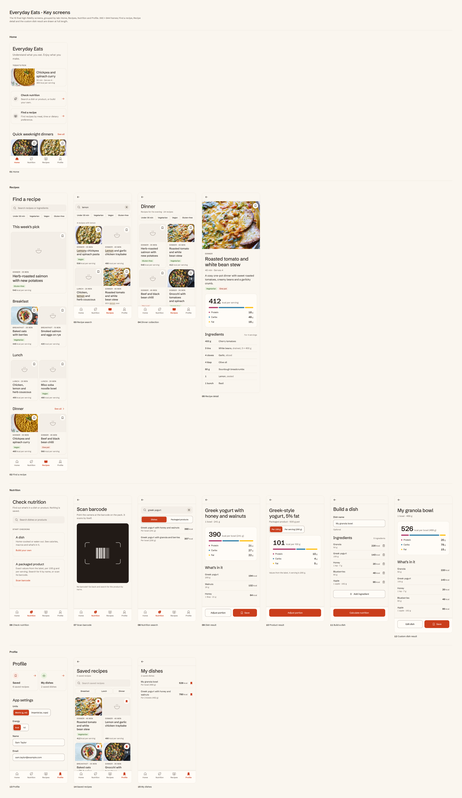

# Everyday Eats — Key screens and flows

The final high-fidelity screens and the five UX flows of Everyday Eats, a mobile food and nutrition app with two jobs: tell me what's in this dish or product, and help me find something good to cook.

## Contents

| File | What it is |
| --- | --- |
| `everyday-eats-key-screens-and-flows.pdf` | Everything in one PDF (20 pages, bookmarked): the 15 screens, then the five flows. Vector text, so it stays sharp at any zoom |
| `screens-overview.png` | All 15 screens on one sheet, grouped by tab |
| `screens/` | Each screen as its own PNG (2× resolution, 780px wide) |
| `flows/` | Each flow as its own PNG (2× resolution) |
| `ux-flows.md` | The written flows: goals, steps, diagrams, navigation rules and edge cases |

## App structure

Four tabs: **Home · Nutrition · Recipes · Profile**. Profile holds two action cards side by side, Saved and My dishes, and the App settings on the same screen. There is no food logging, daily total, calorie target, diary, streak or social feature: saving keeps a recipe or a dish to come back to and never counts towards anything.

## Screens

Every screen is a 390 × 844 frame. Find a recipe, Recipe detail and the custom dish result are drawn at full length so every section shows.

| # | Screen | Tab | What it shows |
| --- | --- | --- | --- |
| 01 | [Home](screens/01-home.png) | Home | Intro, Today's pick, the two main actions (Check nutrition, Find a recipe) and Quick weeknight dinners |
| 02 | [Find a recipe](screens/02-find-a-recipe.png) | Recipes | Search, filters, This week's pick, then Breakfast, Lunch and Dinner |
| 03 | [Recipe search](screens/03-recipe-search.png) | Recipes | Results for "lemon", matches highlighted by name and by ingredient |
| 04 | [Dinner collection](screens/04-dinner-collection.png) | Recipes | A collection with filter chips and recipe cards |
| 05 | [Recipe detail](screens/05-recipe-detail.png) | Recipes | Hero photo with the bookmark, tags, nutrition per serving, ingredients |
| 06 | [Check nutrition](screens/06-check-nutrition.png) | Nutrition | Search a dish or product, or build your own; a Scan barcode link on the packaged product card |
| 07 | [Scan barcode](screens/07-scan-barcode.png) | Nutrition | Camera view for a packaged product's barcode; it opens the product result |
| 08 | [Nutrition search](screens/08-nutrition-search.png) | Nutrition | Results under the Dishes and Packaged products tabs |
| 09 | [Dish result](screens/09-dish-result.png) | Nutrition | Calories, macros and every ingredient; Adjust portion and Save |
| 10 | [Product result](screens/10-product-result.png) | Nutrition | Values per 100 g or per serving |
| 11 | [Build a dish](screens/11-build-a-dish.png) | Nutrition | Dish name, ingredients with exact amounts, Calculate nutrition |
| 12 | [Custom dish result](screens/12-custom-dish-result.png) | Nutrition | The built dish's nutrition; Edit dish and Save |
| 13 | [Profile](screens/13-profile.png) | Profile | Saved and My dishes as two action cards side by side, then App settings: units and energy as segmented controls, editable name and email |
| 14 | [Saved recipes](screens/14-saved-recipes.png) | Profile | Saved recipe cards with search and a meal filter |
| 15 | [My dishes](screens/15-my-dishes.png) | Profile | Saved dishes, built or searched |

States such as saved, removed, empty, filtered, an adjusted portion, an open sheet and edit mode are states of these screens, not extra screens. The flows show them.

## Flows

| # | Flow | Image |
| --- | --- | --- |
| 1 | Find and save a recipe | [flow-1-find-and-save-a-recipe.png](flows/flow-1-find-and-save-a-recipe.png) |
| 2 | Browse a collection | [flow-2-browse-a-collection.png](flows/flow-2-browse-a-collection.png) |
| 3 | Check a dish, or scan a packaged product | [flow-3-check-a-dish.png](flows/flow-3-check-a-dish.png) |
| 4 | Build your own dish | [flow-4-build-your-own-dish.png](flows/flow-4-build-your-own-dish.png) |
| 5 | Profile, saved content and settings | [flow-5-profile-saved-content-and-settings.png](flows/flow-5-profile-saved-content-and-settings.png) |

Each flow tells one scenario once: the real screens at 80% scale, joined by arrows, with what is tapped above each arrow and why the next screen follows below it. The steps, diagrams and edge cases are in [ux-flows.md](ux-flows.md).

Typeface: Schibsted Grotesk (SIL Open Font License), via Google Fonts.
