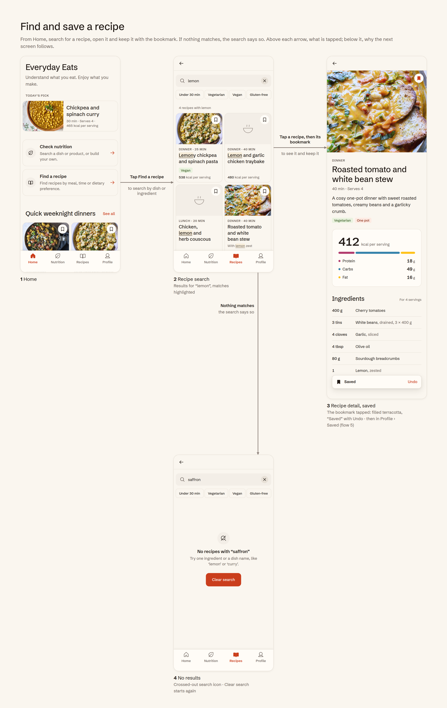
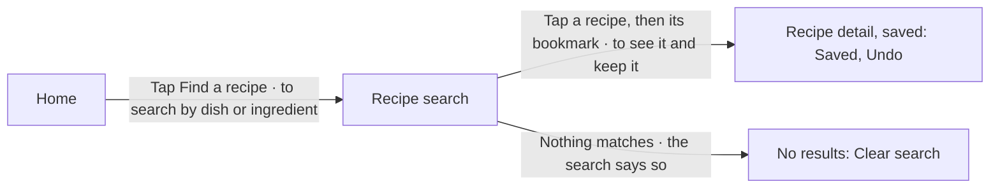
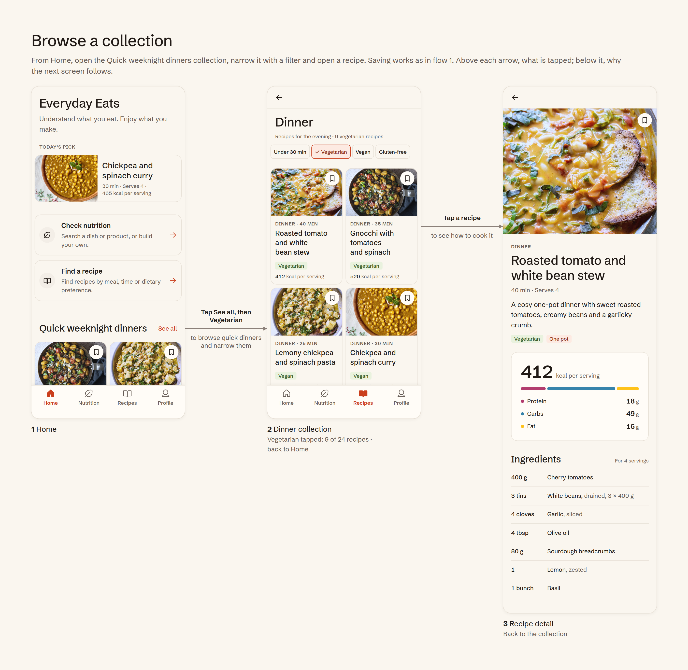
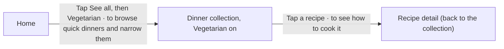
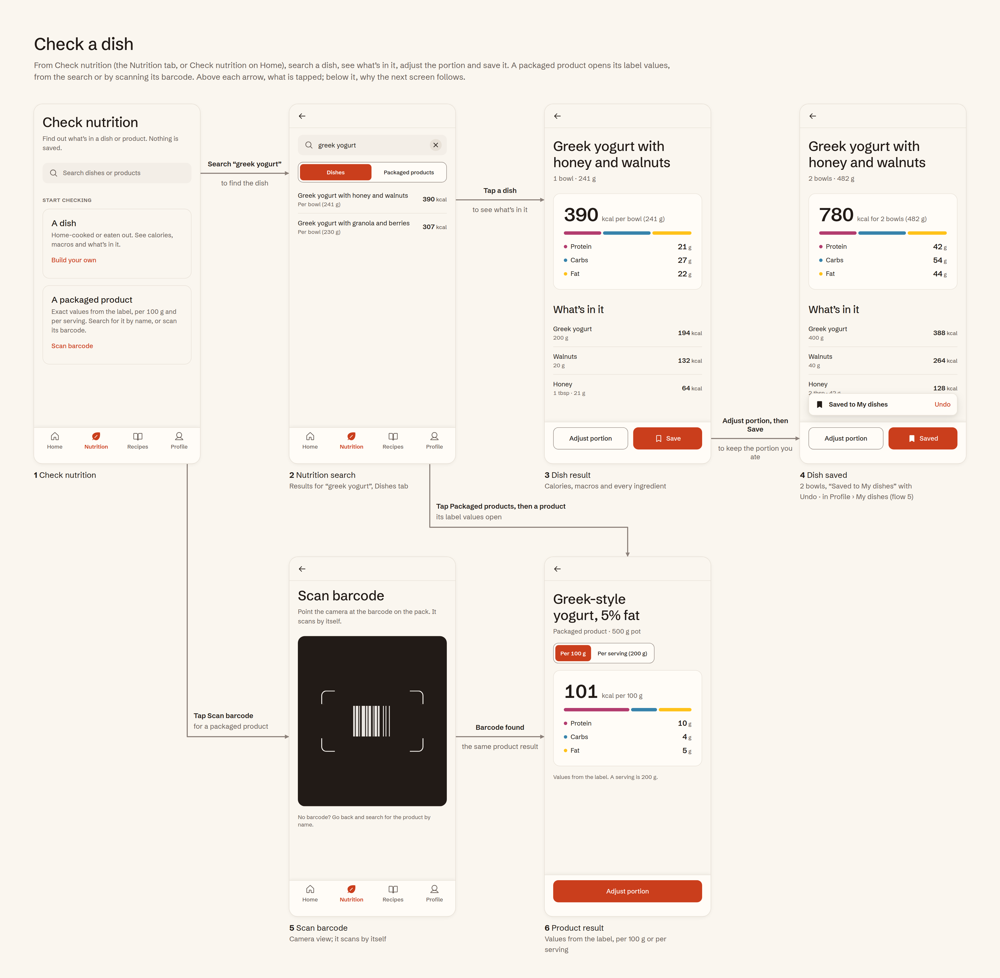
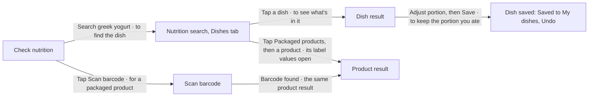
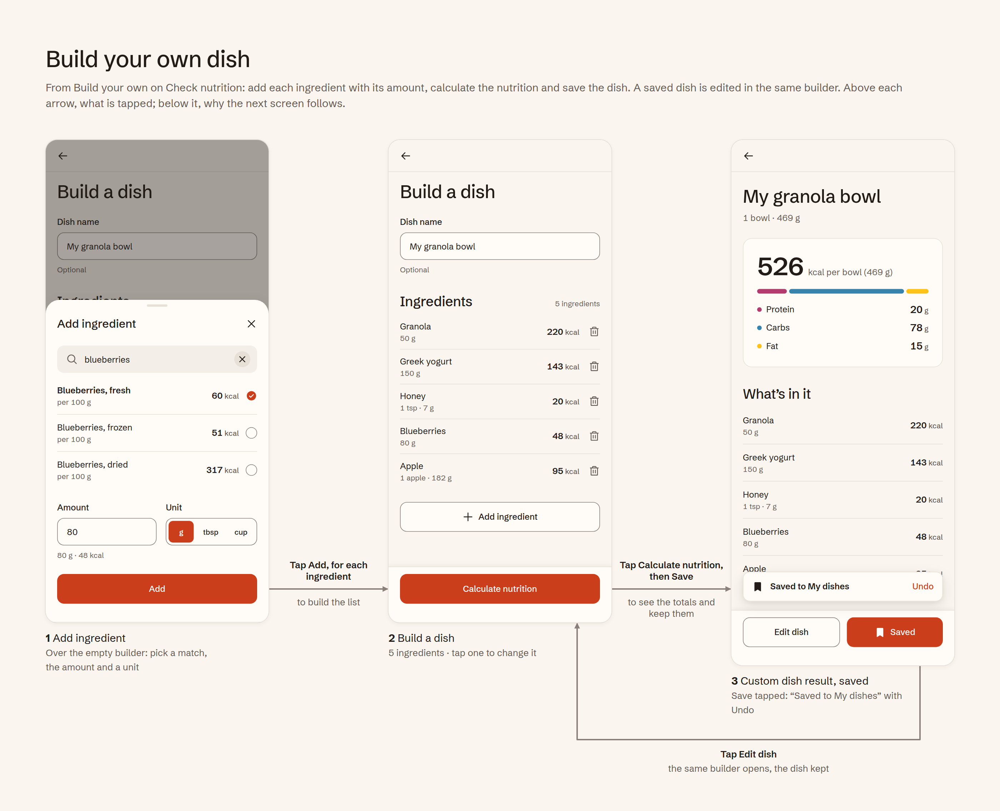
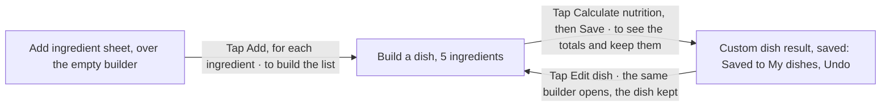
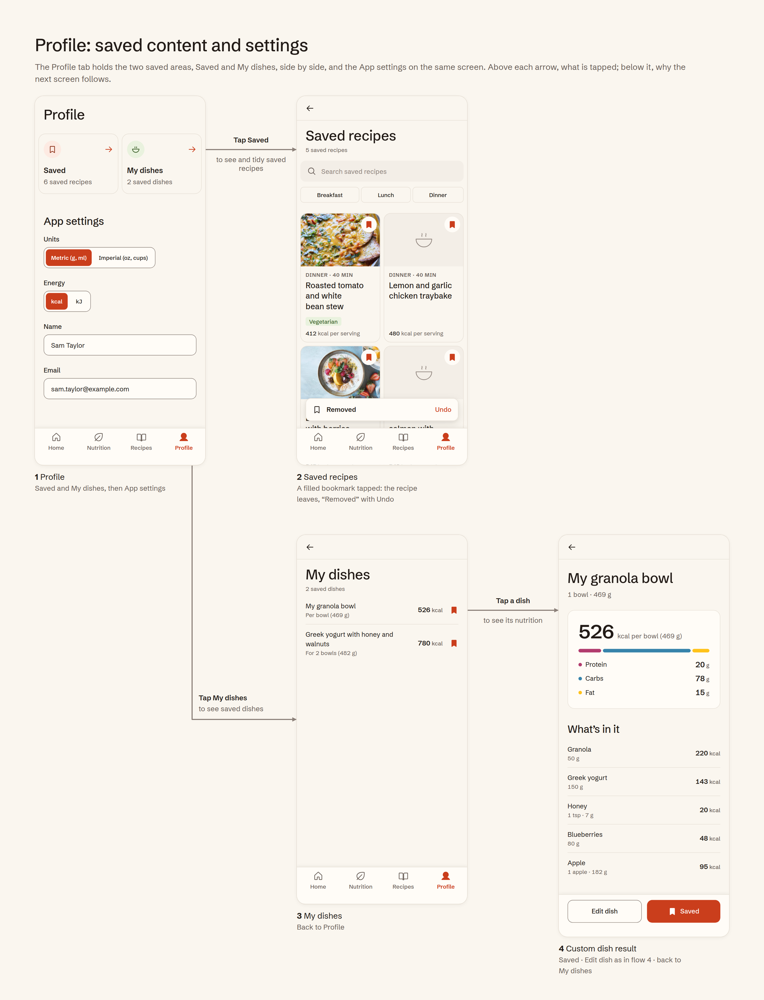
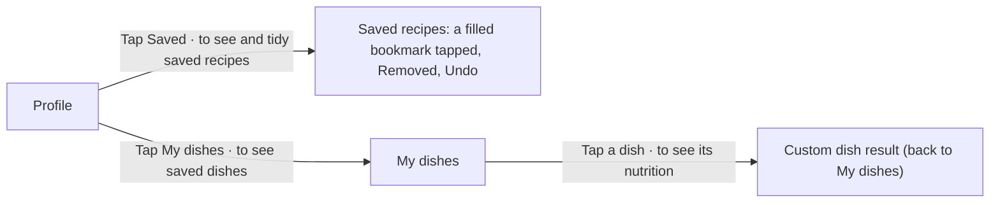

# Everyday Eats — UX flows

The app does two jobs, checking nutrition and finding a recipe, and the flows are grouped into five scenarios. Each one is drawn in [flows/](flows) as the real screens at 80% scale, joined by arrows: what is tapped is written above each arrow, and why the next screen follows below it. Each flow tells one scenario once, a main path and at most one or two branches, with each screen shown once (a state change on the same screen is named in its caption), arrows running forward without crossing, and no tap outlines on the screens.

| # | Scenario | Path | Ends on | Image |
| --- | --- | --- | --- | --- |
| 1 | Find and save a recipe | Home → Find a recipe → Recipe search → Recipe detail, saved (bookmark: "Saved", Undo). Branch: no results | Recipe detail, saved | [flow-1](flows/flow-1-find-and-save-a-recipe.png) |
| 2 | Browse a collection | Home → See all, then Vegetarian → Dinner collection, filtered → Recipe detail | Recipe detail | [flow-2](flows/flow-2-browse-a-collection.png) |
| 3 | Check a dish | Check nutrition → Nutrition search (Dishes tab) → Dish result → Adjust portion, then Save → Dish saved. Branches: Packaged products tab → Product result; Scan barcode → the same Product result | Profile › My dishes | [flow-3](flows/flow-3-check-a-dish.png) |
| 4 | Build your own dish | Add ingredient (sheet over the empty builder) → Build a dish, 5 ingredients → Calculate nutrition, then Save → Custom dish result, saved. Edit dish loops back to the same builder | Profile › My dishes | [flow-4](flows/flow-4-build-your-own-dish.png) |
| 5 | Profile, saved content and settings | Profile → Saved → Saved recipes (remove with the bookmark: "Removed", Undo). Branch: My dishes → a dish. App settings are on Profile itself | Profile | [flow-5](flows/flow-5-profile-saved-content-and-settings.png) |

**Screens are reused, not copied.** Saving, removing, filtering, empty, an adjusted portion, a sheet and edit mode are states of the same screen, never extra screens. Recipe detail, Dish result, Custom dish result and Build a dish are each one screen. Edit dish returns to the existing Build a dish, and there's no "Check another": back navigation does that.

## Screen inventory

| Area | Screen | Built as |
| --- | --- | --- |
| Home | Home | Screen |
| Nutrition | Check nutrition | Screen |
| Nutrition | Scan barcode | Screen: a camera view that scans by itself, then opens the product result |
| Nutrition | Nutrition search | One screen: the Dishes and Packaged products tabs switch the results; a no-match state |
| Nutrition | Dish result | One screen; the Adjust portion sheet, the updated portion, saved, snackbar and back destination (search results or My dishes) are states. Actions: Adjust portion and Save, never Edit |
| Nutrition | Product result | One screen: per 100 g or per serving, and the Adjust portion sheet; back to the search results, or to Check nutrition when opened from Scan barcode |
| Nutrition | Build a dish | One screen: empty, with ingredients, edit mode (Edit dish), and the ingredient sheet (Add ingredient, Edit ingredient) |
| Nutrition | Custom dish result | One screen; saved, snackbar, a no-data ingredient and back destination (Build a dish or My dishes) are states |
| Recipes | Find a recipe | Screen (This week's pick, Breakfast, Lunch, Dinner) |
| Recipes | Recipe search | One screen with a no-results state; back to Home or Recipes |
| Recipes | Dinner collection | One screen, opened from Recipes or from Home, with the Vegetarian filter as a state |
| Recipes | Recipe detail | One screen for every recipe; saved, snackbar and back destination are states |
| Profile | Profile | Screen: two action cards side by side (Saved, My dishes) and App settings (Units, Energy, editable Name and Email) |
| Profile | Saved recipes | One screen; removed, filtered, no search results and empty are states |
| Profile | My dishes | One screen; removed and empty are states |

**Navigation.** Four tabs: Home, Nutrition, Recipes, Profile. A screen reached from a tab keeps that tab active: recipe search and the Dinner collection keep Recipes active even when opened from Home; Saved recipes and My dishes keep Profile active. No sign-in.

**Top bars.** Every screen below a tab has the same top bar: the back arrow alone in a 44px target, nothing else. Its accessible name says where it goes. The screen title is an H1 in the content, never centred in the bar.

| Screen | Back goes to |
| --- | --- |
| Recipe search; Dinner collection | Home when opened from Home (Find a recipe; Quick weeknight dinners · See all); Recipes when opened from the Recipes tab |
| Recipe detail | The screen it was opened from: search results, the collection, Recipes, Home or Saved recipes |
| Saved recipes, My dishes | Profile |
| Nutrition search; Scan barcode | Check nutrition |
| Dish result, product result | Search results; My dishes when the dish is opened from there; Check nutrition when the product is opened from Scan barcode |
| Build a dish | Check nutrition; Edit dish goes back to the saved dish |
| Custom dish result | Build a dish; My dishes when opened from there |

**Scope for v1.** In: nutrition for dishes and packaged products (search, barcode scan for packaged products, build your own), recipe search and browsing, saving recipes and dishes (built or searched), App settings on Profile. Out: photo nutrition estimate, sign-in, personal data, dark mode, meal logging, daily totals, calorie targets, diary, streaks, social features, onboarding, cooking mode, recipe creation, manual nutrition entry. Calculations are never saved automatically: a dish is kept only when the user taps Save, and a saved searched dish stays read-only apart from its portion.

## Flow 1: Find and save a recipe

**User goal.** "Help me find something good to cook, and keep it for later." **Starts on:** Home.

1. On Home, tap **Find a recipe** to search by dish or ingredient. Recipe search opens, with its back arrow to Home.
2. **Recipe search:** "4 recipes with lemon", filter chips, then recipe cards. Every occurrence of "lemon" is highlighted; a recipe matched by an ingredient says so under its title ("With lemon zest").
3. Tap a recipe to see what's in it. **Recipe detail** (back to the results): the hero photo with the bookmark, tags, nutrition per serving, then ingredients.
4. Tap the **bookmark** to keep it for later: it fills terracotta and a snackbar says "Saved" with Undo. Tapping it again removes it ("Removed"). The recipe is then in Profile › Saved (flow 5).
5. **Nothing matches** ("saffron"): the search says so with the search icon crossed out, suggests one ingredient or a dish name, and offers **Clear search**.

The Recipes tab's search field opens the same search; back then returns to Recipes.

## Flow 2: Browse a collection

**User goal.** "Show me what's good for dinner, then let me pick." **Starts on:** Home.

1. On Home, tap **See all** beside Quick weeknight dinners to browse every quick dinner. The Dinner collection opens with the Recipes tab active; back returns to Home.
2. **Dinner collection:** "Recipes for the evening · 24 recipes", four filter chips and the recipe cards.
3. Tap **Vegetarian** to narrow the list: the chip gets a Terracotta 50 fill, border and check, and the count reads "9 vegetarian recipes".
4. Tap a recipe to see how to cook it: the same Recipe detail as in flow 1, with back to the collection. Saving works as in flow 1.

From the Recipes tab, Dinner · See all opens the same collection; back then returns to Recipes.

## Flow 3: Check a dish

**User goal.** "What's in this dish or product?" **Starts on:** Check nutrition (the Nutrition tab, or Check nutrition on Home).

1. **Check nutrition:** "Find out what's in a dish or product. Nothing is saved." Search is the main action. Under "Start checking", two cards: "A dish" with Build your own, and "A packaged product" with Scan barcode, both plain text links.
2. Search "greek yogurt" to find the dish. **Nutrition search** (back to Check nutrition): two tabs under the field, Dishes and Packaged products, a segmented control whose selected tab is filled Terracotta 500; tapping a tab switches the results below. Each row starts with what its number is per: "Per bowl (241 g)" or "Per 100 g · 500 g pot".
3. Tap a dish to see what's in it. **Dish result** (back to the results): calories, macro bar and legend, then every ingredient, adding up to the total. The actions are Adjust portion and Save.
4. Tap **Adjust portion** to match what you ate: a sheet with the amount and the dish's own units as a segmented control (bowl or g).
5. Tap **Update, then Save** to keep it in My dishes: 2 bowls = 482 g · 780 kcal. Save stays the primary button and becomes "Saved" with a white filled bookmark; the snackbar says "Saved to My dishes" with Undo. A saved searched dish is never editable; only its portion changes.
6. For a packaged product, tap **Scan barcode**: a camera view that scans by itself. When the barcode is found, its label values open in the **Product result** (per 100 g or per serving), with back to Check nutrition. Under the Packaged products tab, tapping a product opens the same screen.
7. **Nothing matches** ("grandma's stew"): the search icon crossed out, a simpler name suggested, and **Build your own**.

## Flow 4: Build your own dish

**User goal.** "I made this myself. What's in it?" Build your own is a nutrition calculator, not a recipe builder: no cooking steps, no recipe creation, no meal logging and no typed-in nutrition values. **Starts on:** Build a dish, from Build your own on Check nutrition (or on the nutrition search's no-match state).

1. **Build a dish** (back to Check nutrition): an optional Dish name, "No ingredients yet" and an outlined Add ingredient button. Calculate nutrition stays disabled with "Add at least one ingredient to calculate nutrition".
2. Tap **Add ingredient** to add what went into it: a sheet with the search, the matches (per 100 g, exactly one selected), the amount and the ingredient's own units as a segmented control (g · tbsp · cup). Only units with a defined conversion appear; grams is always there. The helper shows the calculation: "80 g · 48 kcal".
3. Tap **Add**, for each ingredient, to build the list. Each row shows the unit chosen, then grams ("1 apple · 182 g"), and its kcal; tap a row to change it (Edit ingredient), and the trash removes it.
4. Tap **Calculate nutrition** to see the totals. **Custom dish result** (back to Build a dish): the dish name, portion, nutrition summary and ingredients, with Edit dish and Save. An ingredient without data is marked "No data", never 0.
5. Tap **Save** to keep it in My dishes: the button becomes "Saved" with a white filled bookmark, and the snackbar says "Saved to My dishes" with Undo.
6. Tap **Edit dish** to change it later: the same Build a dish in edit mode, with the name, ingredients and amounts kept. Save changes or Cancel return to the dish.

## Flow 5: Profile, saved content and settings

**User goal.** "Find what I kept, tidy up, and set my units." **Starts on:** the Profile tab.

1. **Profile:** two action cards side by side, in the Home action-row style, **Saved** ("6 saved recipes", a bookmark on a Terracotta 50 circle) and **My dishes** ("2 saved dishes", the Dish icon on a Herb 50 circle). Below them, **App settings** on the same screen: Units and Energy as segmented controls, applied at once, and Name and Email as editable fields.
2. Tap **Saved** to see saved recipes. **Saved recipes** (back to Profile): search, a Breakfast / Lunch / Dinner filter and the recipe cards.
3. Tap a **filled bookmark** to remove the recipe: the card leaves and the snackbar says "Removed" with Undo. When the last one goes, the empty state offers Find a recipe.
4. Tap **My dishes** to see saved dishes (back to Profile): built and searched dishes, each with its kcal and a filled bookmark that removes it.
5. Tap a dish to see its nutrition: a built dish opens its Custom dish result (Edit dish as in flow 4), a searched dish its Dish result (Adjust portion only); back returns to My dishes.

## Edge cases

| Case | What the user sees | Built from |
| --- | --- | --- |
| No dish or product matches | "No match for '…'", "Try a simpler name, like 'beef stew'. Made it yourself?" and Build your own | Empty state |
| No recipe matches | "No recipes with '…'", one ingredient or a dish name suggested, and Clear search | Empty state |
| Saved recipes search finds nothing | "No saved recipes match '…'", "Try a simpler name, like 'stew'." and Clear search | Empty state |
| Nothing saved yet | Saved recipes: Find a recipe; My dishes: Check nutrition | Empty state |
| No ingredients yet | "No ingredients yet" in the builder; Calculate nutrition disabled with the reason | Empty state, disabled button with hint |
| An ingredient has no nutrition data | The row shows a "No data" label, never 0, and one line above the list says it isn't counted | Breakdown row (No data) |
| Amount not a number | Field error: "Enter a number, like 250"; numbers don't change until it's valid | Text field (error) |
| Unit with no defined conversion | Not offered: the unit options only show units the database can convert, grams always included | Segmented control |
| Diet tag uncertain | The tag is left off rather than guessed | Content rule |
| Loading | Skeleton cards or a skeleton panel, never a full-screen spinner | Skeleton |
| No connection | "Couldn't load nutrition. Check your connection and try again." | Info note |

## Open decisions

- [ ] The "suitable for me" preferences step: not designed.
- [x] Renaming a dish: resolved. Edit dish opens Build a dish in edit mode with the name, ingredients and amounts kept, and the name is changed there.
- [x] Home hero: resolved. Home shows Today's pick, a real recipe from the app (the chickpea and spinach curry) that opens its recipe detail.
- [x] Saving a recipe on Recipe detail: resolved. The same compact bookmark as the recipe cards, on the photo.

## Components the flows need

Every screen is built from the shared components in the design system; the same interaction always uses the same component.

- Navigation: top bar (back arrow), tab bar (Home, Nutrition, Recipes, Profile), sticky action bar.
- Actions: primary button, outlined button, text link, bookmark button (recipes), save control (dishes, always the primary button), action row (Home; as two action cards side by side on Profile).
- Inputs: search field (one clear X), text field, filter chips, segmented control (single choices and the nutrition search tabs), amount field, option row.
- Content: recipe card and featured card, tag, option card, section header, list rows (breakdown, link, saved dish, editable), photo placeholder, empty state.
- Nutrition: the one nutrition summary panel, used on dish results, custom dish results, product results and recipe detail.
- Feedback: snackbar with Undo, bottom sheet, info note, spinner and skeleton for loading.
